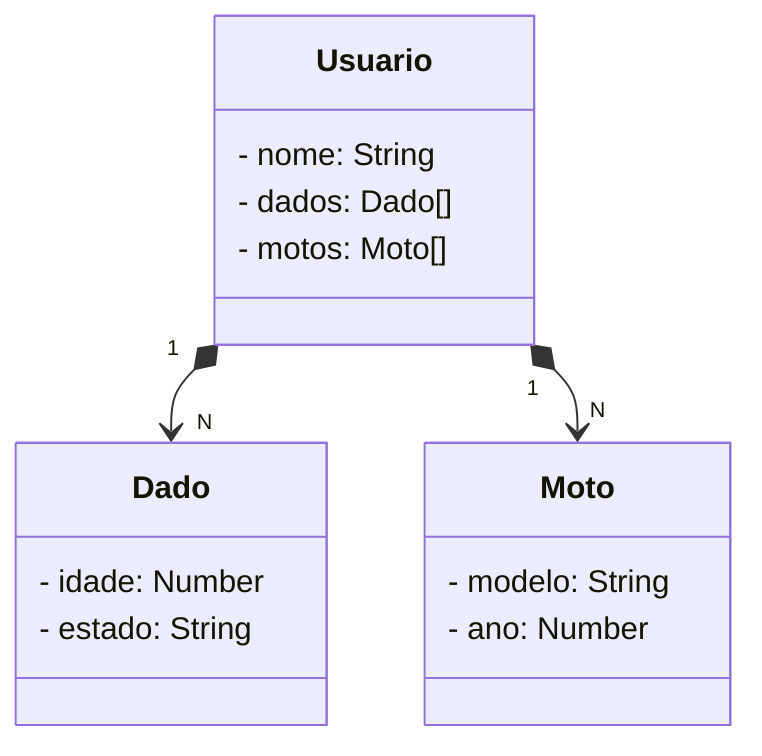

# Moto Clube Saqua
Java Restful API criada para Moto Clube Saqua

## Driagrama de Classes

```mermaid
classDiagram
  class Usuario {
    - nome: String
    - dados: Dado[]
    - motos: Moto[]
  }
  class Dado {
    - idade: Number
    - estado: String
  }
  class Moto {
    - modelo: String
    - ano: Number
  }

  Usuario "1" *-->"N" Dado
  Usuario "1" *-->"N" Moto
```
